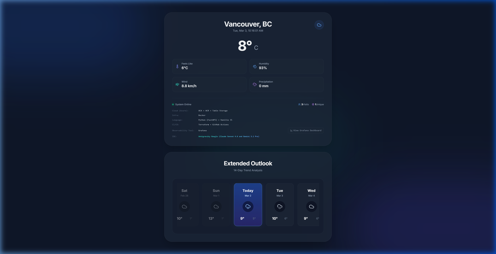
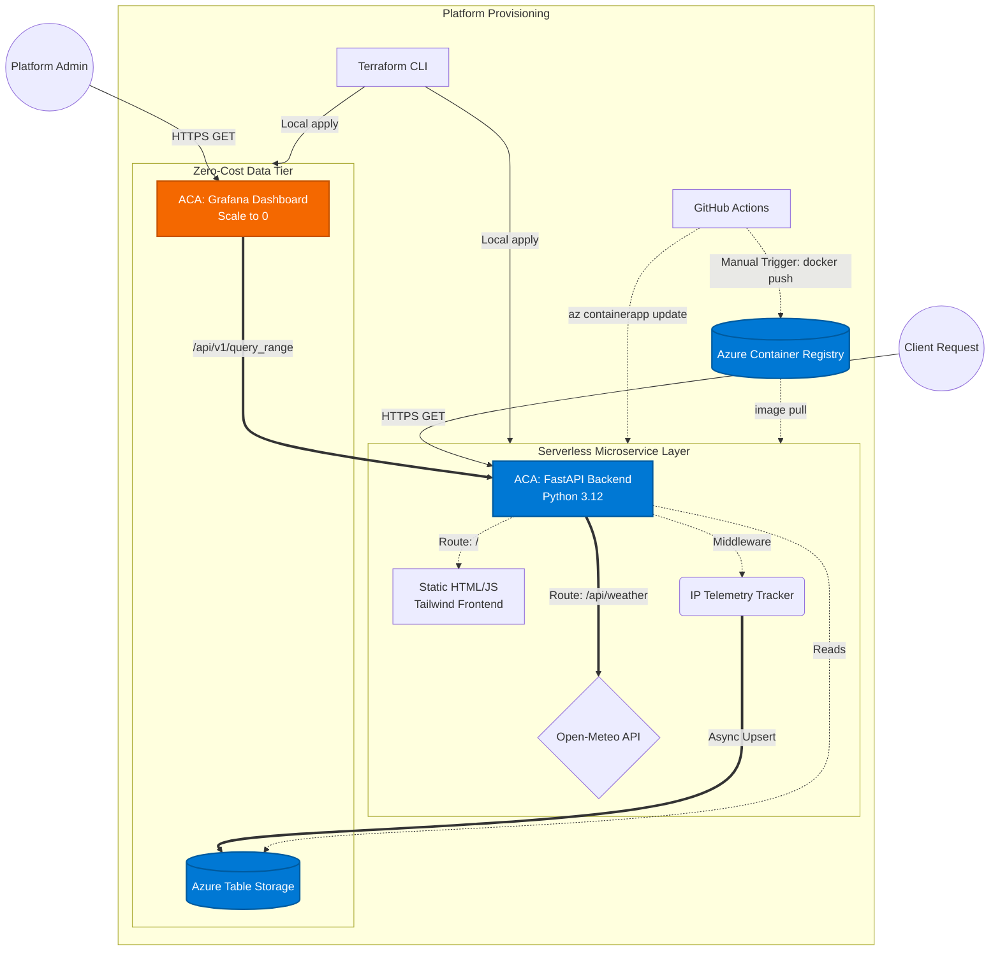

# Vancouver Weather Microservice 🌦️

A cloud-native, serverless weather application engineered to showcase advanced platform architecture, real-time telemetry processing, and extreme **FinOps** (Cloud Cost Optimization) practices.

This repository isn't just a weather app—it is a blueprint for building high-performance, $0/month production platforms on Azure.

**Live Demo: [tinyurl.com/AzureWeatherApp](https://tinyurl.com/AzureWeatherApp)**

## 🎯 Platform Engineering Highlights

This project demonstrates a robust, production-ready stack designed around the core tenets of Modern Platform Engineering, specifically utilizing **Azure Container Apps** and **Serverless** paradigms.

### 💰 FinOps & Zero-Cost Observability
- **Serverless Telemetry**: Pivoted from a traditional 24/7 Prometheus database to **Azure Table Storage**. Site visits and unique IPs are tracked via FastAPI middleware and written asynchronously to deep, low-cost NoSQL storage.
- **Custom Prometheus API**: To maintain Grafana compatibility natively, the Python FastAPI backend implements a custom, mock `PromQL` endpoint (`/api/v1/query_range`), serving Azure Table Storage metric counts as native Prometheus time-series matrices directly to Grafana. No Prometheus instance is running, but Grafana doesn't know the difference.
- **Scale-to-Zero Dashboards**: The Grafana visualization layer is deployed on Azure Container Apps with a `min_replicas = 0` rule. When the dashboard is not actively being viewed, the Grafana container scales down to exactly 0, pausing all compute costs.

### 🏗️ Architecture & Automation
- **Infrastructure as Code (IaC)**: Fully automated provisioning of Azure Container Registry (ACR), Azure Container Apps (ACA), Log Analytics Workspaces, and Storage Accounts using **Terraform (HCL)**.
- **Microservices Architecture**: A decoupled **Python FastAPI** backend serving as an API layer, consuming external APIs asynchronously (`httpx`), packed in a minimal Docker footprint.
- **Continuous Integration / Continuous Deployment (CI/CD)**: Application deployments are handled via **GitHub Actions** using a manual `workflow_dispatch` trigger for strict deployment control. Running the workflow authenticates via Azure Service Principals, builds the Docker images, pushes to ACR, and executes zero-downtime rolling updates to the ACA environment. Terraform (IaC) is applied sequentially from the local environment to prevent remote state drift.
- **Frontend Developer Experience**: A sleek, responsive user interface utilizing Tailwind CSS, Lucide Icons, and Vanilla JavaScript. Features a responsive 14-day extended outlook weather carousel.

---

## 🏗️ Cloud Native Architecture



---

## 🚀 Getting Started

### Prerequisites
- [Docker Engine](https://docs.docker.com/get-docker/)
- [Terraform CLI](https://developer.hashicorp.com/terraform/downloads) (1.x+)
- [Azure CLI](https://learn.microsoft.com/en-us/cli/azure/install-azure-cli) (Logged in with `az login`)

### Local Development (Docker Compose)

A fully containerized local environment is provided to test the FastAPI backend and Grafana dashboard interaction without Azure credentials.

1. **Clone and run the application locally**:
   ```bash
   git clone <repo>
   cd azure-weather-app
   docker compose up -d
   ```
2. **Access the Weather App**: `http://localhost:8000`
3. **Access Grafana Metrics**: `http://localhost:3000`

### Cloud Deployment (Azure)

We utilize a comprehensive CI/CD pipeline, but you can deploy from your CLI:

```bash
# 1. Initialize and apply Terraform
cd infrastructure
terraform init
terraform apply -var="project_name=yourname" -var="environment=prod"

# 2. Get the ACR login server and Docker Login
ACR_SERVER=$(terraform output -raw acr_login_server)
az acr login --name $ACR_SERVER

# 3. Build & Push App and Grafana Custom Images
docker build -t $ACR_SERVER/vancouver-weather-app:latest ./app
docker push $ACR_SERVER/vancouver-weather-app:latest

docker build -t $ACR_SERVER/weather-grafana:latest ./infra-local
docker push $ACR_SERVER/weather-grafana:latest

# 4. Force Container App to Pull Latest Image and Restart
# (Simply using update --image doesn't always pull if the tag 'latest' hasn't changed)
APP_REV=$(az containerapp revision list -n ca-yourname-prod -g rg-yourname-prod --query "[0].name" -o tsv)
az containerapp revision restart --revision $APP_REV -n ca-yourname-prod -g rg-yourname-prod

GRAFANA_REV=$(az containerapp revision list -n ca-grafana-yourname-prod -g rg-yourname-prod --query "[0].name" -o tsv)
az containerapp revision restart --revision $GRAFANA_REV -n ca-grafana-yourname-prod -g rg-yourname-prod
```

Alternatively, configure your `AZURE_CREDENTIALS` (Service Principal), `ACR_USERNAME`, and `ACR_PASSWORD` in GitHub Secrets. You can then navigate to the **Actions** tab in GitHub and manually trigger the **Deploy to Azure Container Apps** workflow to push code changes directly to Azure.

---

## 🛡️ Operational Considerations

- **Security Context**: The Dockerfiles are specifically configured to drop root privileges (`USER appuser`) avoiding container escape vulnerabilities.
- **FinOps Routing**: Grafana dynamically calculates its API route natively from the Container App host injection via `datasource.yml` variable interpolation, completely eliminating hardcoded domains.
- **Stateless Design**: Designed perfectly for Kubernetes scaling, the application does not persist any local state on the container filesystem and reads entirely from environment variables and HTTP contexts.

**Tech Stack**: Azure Container Apps, Azure Table Storage, Terraform, Docker, Python (FastAPI), Grafana, GitHub Actions, Bash, HTML/Tailwind, Antigravity Google (Claude Sonnet 4.6 & Gemini 3.1 Pro).
